# Secure Auth Portal

A Python/FastAPI web application demonstrating enterprise authentication patterns: OIDC/OAuth2 with Entra ID, SAML 2.0, ID-porten (Norwegian public auth), secrets management with HashiCorp Vault, PKI certificate management, and Infrastructure as Code with Terraform.

Built as a hands-on exploration of the technologies used in platform engineering for identity and access management.

## Technologies

| Technology | Implementation | Purpose |
|---|---|---|
| Python / FastAPI | REST API backend | Core web framework |
| OIDC / OAuth2 | Authorization Code Flow + PKCE | Modern authentication |
| SAML 2.0 | Service Provider with metadata | Enterprise SSO |
| Microsoft Entra ID | Identity Provider (cloud) | Cloud identity platform |
| Active Directory | PowerShell admin scripts | On-prem identity |
| ID-porten | OIDC integration module | Norwegian public auth |
| HashiCorp Vault | Secrets + PKI CA | Secrets and certificate management |
| Terraform | Entra ID app registration | Infrastructure as Code |
| Git | Conventional commits | Version control |
| pytest | Unit tests (13 tests) | Quality assurance |

## Architecture


## OIDC Authentication Flow

```mermaid
sequenceDiagram
    actor User
    participant App as FastAPI App
    participant Entra as Entra ID

    User->>App: 1. Click "Log in"
    App->>App: Generate PKCE pair + state
    App->>Entra: 2. Redirect with code_challenge
    Entra->>User: 3. Show login page
    User->>Entra: 4. Enter credentials
    Entra->>App: 5. Redirect with authorization code
    App->>Entra: 6. Exchange code + code_verifier for tokens
    Entra->>App: 7. Return ID token (JWT)
    App->>App: 8. Validate JWT (RS256, issuer, audience, exp)
    App->>User: 9. Access granted — show dashboard
```


## Secrets Management Flow


## Quick Start
```bash
git clone https://github.com/dannyp19921/secure-auth-portal.git
cd secure-auth-portal
python3 -m venv venv
source venv/bin/activate
pip install -r requirements.txt
cp .env.example .env
# Fill in Entra ID values (see setup below)
uvicorn app.main:app --reload
```

## Entra ID Setup

1. Go to entra.microsoft.com > App registrations > New registration
2. Name: "Secure Auth Portal", Redirect URI: Web + `http://localhost:8000/callback`
3. Note the Application (client) ID and Directory (tenant) ID
4. Certificates & secrets > New client secret > copy value
5. Add all three values to `.env`

## Vault Integration
```bash
# Start Vault in dev mode
vault server -dev -dev-root-token-id="dev-token" &
export VAULT_ADDR='http://127.0.0.1:8200'
export VAULT_TOKEN='dev-token'

# Store client secret
vault kv put secret/secure-auth-portal/entra client_secret="YOUR-SECRET"

# Enable in .env: VAULT_ENABLED=true
```

## PKI (Vault as Internal CA)
```bash
# Set up internal Certificate Authority
./scripts/setup_pki.sh

# Issue a certificate
vault write pki/issue/auth-portal common_name="api.auth-portal.internal" ttl=24h
```

## SAML 2.0

The app includes a SAML Service Provider with:
- SP metadata endpoint: `/saml/metadata`
- Assertion Consumer Service: `/saml/acs`
- Protocol comparison (SAML vs OIDC) documentation

## ID-porten

ID-porten module demonstrates Norwegian public sector authentication:
- Same OIDC flow as Entra ID
- Security levels: substantial (MinID) and high (BankID)
- Info endpoint: `/idporten`

## Troubleshooting

Built-in diagnostic tool for systematic root cause analysis:
```bash
python scripts/troubleshoot_auth.py --check all
```

See [TROUBLESHOOTING.md](TROUBLESHOOTING.md) for the complete guide covering OIDC, SAML, Vault, and PKI failures.

## Active Directory (PowerShell)
```powershell
# User lookup
.\scripts\ad_lookup.ps1 -Action LookupUser -Identity "daniel.parker"

# Check account lockout
.\scripts\ad_lookup.ps1 -Action CheckLockout -Identity "daniel.parker"

# Find expired passwords
.\scripts\ad_lookup.ps1 -Action ListExpiredPasswords -Days 30
```

## Terraform (IaC)
```bash
cd terraform
terraform init
terraform plan -var="tenant_id=YOUR-TENANT-ID"
```

## Testing
```bash
pytest tests/ -v   # 13 tests covering PKCE, config, ID-porten, utilities
```

## Project Structure
```
secure-auth-portal/
|-- app/
|   |-- main.py                # FastAPI routes + UI
|   |-- config.py              # Settings with Vault integration
|   |-- auth/
|       |-- oidc.py            # OIDC: discovery, PKCE, token exchange, JWT validation
|       |-- dependencies.py    # Auth middleware
|       |-- saml_routes.py     # SAML 2.0 Service Provider
|       |-- saml/settings.json # SAML SP/IdP configuration
|       |-- idporten.py        # ID-porten OIDC module
|       |-- utils.py           # Shared utilities (DRY)
|-- terraform/
|   |-- main.tf                # Entra ID app registration
|   |-- variables.tf           # Input variables
|   |-- outputs.tf             # Output values
|-- scripts/
|   |-- ad_lookup.ps1          # PowerShell AD administration
|   |-- setup_pki.sh           # Vault PKI CA setup
|   |-- troubleshoot_auth.py   # Authentication diagnostics
|-- tests/
|   |-- test_auth.py           # Unit tests (13 tests)
|-- TROUBLESHOOTING.md
|-- .env.example
|-- .gitignore
|-- requirements.txt
|-- README.md
```
